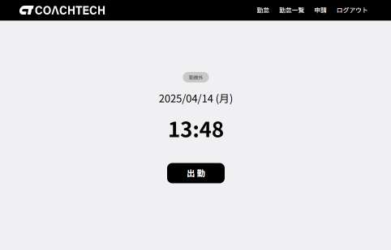
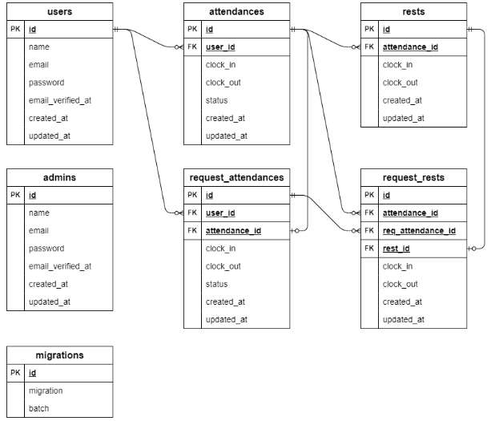

# 実践学習ターム 模擬案件中級_勤怠管理アプリ 

 
 
## 概要 
- サービス名　　:　coachtech勤怠管理アプリ
- 機能　　　　：　独自の勤怠管理アプリ
- システム要件　：　案件シート内の機能要件・非機能要件等記載  
- 特記事項など　：　案件シート内での仕様に加え、以下に挙げる条件・規則を追加しています。  
  | 勤怠関係 |
  | ---- |
  | 勤怠登録できる時間帯は0:00～23:59までの分単位。曜日は月曜日～日曜日まで登録可。<br>日をまたぐとその日のデータとして登録できません。<br>この場合、詳細画面から修正することとしています。|
  | 勤怠データの表示・登録・修正について、当日以降の未来の日付ではできません。 |
  | 一覧表示・修正画面表示画面において、勤務登録のない日は空欄で表示されます。<br> |
  || 
  
  | 管理画面関係 |
  | ---- |
  | CSV出力について、 スタッフ別勤怠一覧画面に表示されているデータを出力します。<br>データ並びについては、先頭行は見出し。２行目はデータベースのカラム名 ３行目以降にデータ本体としています。<br>デフォルトの出力ファイル名は、attendance_userid{番号}_{出力対象の年月}.csvとなります。|
  | 申請一覧については、『対象日時』を基準に並び替えて表示しています。|
  ||

  | seederファイルによるサンプルデータについて |
  | ---- |
  | 動作確認のため、seederファイルでデータを作成します。<br>作成するデータについて、管理者１、一般ユーザー５、勤怠データは、土日を除く、実行してる月の１日から当日の前日までと前月、前々月までとしています。<br>実行当日は、入力確認等のために、一般ユーザー全員勤務外の状態としています。<br>また、休憩回数、休憩時間、備考、申請件数、申請済み件数についてはランダムで作成しています。|
  |　＊　管理者、一般ユーザーのログイン情報は、『Laravelの設定等（６）その他』に記載。|
  ||

## 環境構築  
1. Dockerビルド  
(1) 導入したいディレクトリへ移動し、githubからリポジトリを複製
```
git clone git@github.com:hirobot3103/attendance-app.git
```
(2) 個人が持つgithubアカウントでログインし、リモートリポジトリを作成  
(3) (1)で作成したディレクトリへ移動し、現在のローカルリポジトリのデータをリモートリポジトリに反映させる。  
```
git remote set-url origin 作成したリポジトリのurl
```
(4) 作成したリモートリポジトリに対し、最初のPUSHを行う。
```
git add .
git commit -m "リモートリポジトリの変更"
git push origin main
```
(5). Dockerコマンドを入力し、開発環境を構築
```
$ docker-compose up -d --build
```
＊最初のビルドでは、完了までに時間を要す場合があります。  

1. Laravelの設定等<br>
(1) composerのインストールや複製したリポジトリ内の src/.envファイルなどを編集していきます。  
``` 
docker-compose exec php bash
composer install
cp .env.example .env
exit
```  
  
(2) .envファイルの編集（編集該当部分）  
textエディターを利用し、以下のように書き換えます。  
```  
APP_NAME=Attendance
APP_ENV=local
APP_KEY=
APP_DEBUG=true
APP_TIMEZONE=Asia/Tokyo
APP_URL=http://localhost

APP_LOCALE=ja
APP_FALLBACK_LOCALE=en
APP_FAKER_LOCALE=ja_JP

DB_CONNECTION=mysql
DB_HOST=mysql
DB_PORT=3306
DB_DATABASE=attendance_db
DB_USERNAME=attendance_user
DB_PASSWORD=attendance_pass
TZ=Asia/Tokyo
```
- さらに、ローカル環境でメール送信を行えるようmailtrapを利用するため、
- .envを編集します。(導入方法は https://qiita.com/kazumacchi/items/751232c538ff5a674b1a)
```
MAIL_MAILER=smtp
MAIL_HOST=sandbox.smtp.mailtrap.io
MAIL_PORT=2525
MAIL_USERNAME=設定されたUser名データ
MAIL_PASSWORD=設定されたPasswordデータ
MAIL_FROM_ADDRESS="info@attendance.com"
MAIL_FROM_NAME="${APP_NAME}"
```

(3).envファイルの編集が終ったら、暗号化キーを設定します。  
-このコマンドは、Laravelアプリケーションの暗号化キーを生成します。このキーは、セッションデータの暗号化やその他のセキュリティ機能に使用されます。  
```
docker-compose exec php bash
php artisan key:generate
exit
```  

(4) データベースの作成
- テーブルの構成や予め必要なデータを作成します。  
```
docker-compose exec php bash
php artisan migrate
php artisan db:seed
```

(5)  実行  
- 実際にアプリを利用する場合は以下のURLへアクセスしてください。
- <管理画面>  　　http://localhost/admin/login  
- <一般ユーザー>  http://localhost/login

(6)そのほか  
- 本アプリでは、fortifyを利用しています。(導入の参考 https://qiita.com/MS-0610/items/d86c0936b4b06aedc759 )  
  
- 実際にブラウザ上での動作確認のため、事前にユーザーデータを作成しています。
- ログイン用データ
-
- <管理者>
- email                          password
- administrator@attendance.com   adminadmin

- <一般ユーザー>  
- email                 password
1 user1@attendance.com  password1  
2 user2@attendance.com  password2  
3 user3@attendance.com  password5  
4 user4@attendance.com  password4  
5 user5@attendance.com  password5  

## テスト環境と実施  
1. テスト項目
- D項目：　1,2,3,4,5,6,7,8,9,10,12,13,14,15の14個(11番以外)  

2.　テストへの準備  
- テストを行う前に準備をします。
```
docker-compose exec php bash
php artisan key:generate  --env=testing
php artisan migrate  --env=testing
php artisan db:seed  --class=TestDatabaseSeeder --env=testing
```
3. テスト実施
- 一括テストの場合
```
php artisan test tests/Feature/*
```
- 個別のテストの場合
```
php artisan test tests/Feature/(個々のファイル名)
```

## 使用技術  
・PHP8.3  
・Laravel Framework 10.48.29  
・MySQL 8.0.26

## URL  
Github git@github.com:hirobot3103/attendance-app.git  
開発環境　http://locaohost:80/ , http://locaohost:8080   

## ER図  
- テーブル仕様書については、案件シート内に記載

